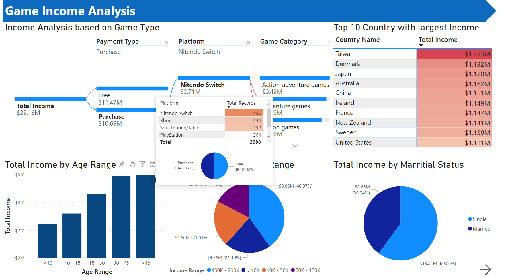

# Decsription of this project

**Domain: Gaming**

Business problem: Maximize user retention and income of game based on game types/platform, user information. Income of a game is defined as the sum between **income by watching ads** or **income by user payment** and **income by purchasing items in game**.

# Purpose

Building the data pipeline to solve the business problem

# Detail of Work

1. Generate one raw flat file related to the domain of project with Python and stored in Raw folder (later will be copied to Working Folder), including:
    - RecordID: Key of record
    - DateOfRecord: Date of record made
    - UserID: ID of user who plays games
    - FullName: Name of user
    - Age: User's Age
    - Gender: User's Gender
    - EmailAddress: User's Email contact information
    - Income: User's Income
    - MarritalStatus: Marrital Status
    - CountryID: ID of country where games is released
    - CountryName: Country Name
    - Region: Region of the contry
    - ZipCode: Zip Code
    - RegisteredDate: Date user registered for the game
    - LastOnline: Last date that user status is online/active for the game
    - GameID: ID of the game users play
    - GameName: Name of the game
    - GamePlatForm: Platform the game was developed (PC, Tablet, PS4, ...)
    - GameCategories: Category of the game
    - ReleaseDate: Date that the game was released
    - PaymentType: Type of purchasing game: Free or Paid
    - IncomeByAds: If the game is free then income by ads is not null and vice versa
    - IncomeByPurchase: If the game is free then income by purchase is null and vice versa
    - IncomeBoughtIngameItems: Income that comes from the cash user paid to buy items in games, available for bot Payment type
    - ModifiedDate: Date that the fake data was generated

2. Design data pipeline and data dimensional model

    *Data pipeline*

    

    *Data dimensional model*
    

3. Ingest data from flat file

    Load one big raw data from [Working folder](./resoures/Working-Folder) into SQL tables.
    Auto create folder to contain database profile, python scripts to upload and unload backup data.

4. Load data onto Snowflake cloud

    By using python scripts, SQL database is connected to SnowFlake cloud server directly.Thus, neither snow pipe nor csv splitting bulk load process is required.

7. Create jobs to run package to upload updated data and unload data from SnowFlake for backup

8. Connect Power BI to Snowflake and build proper dashboard (PowerBI service [link](https://app.powerbi.com/links/G5LkAI9M9E?ctid=f01e930a-b52e-42b1-b70f-a8882b5d043b&pbi_source=linkShare) or [PowerBI Desktop file](./docs/Final_prototype_project02.pbix))

# How to setup

### **Important note**

**Before you run**

- Please ensure that you have snowsql on your machine. Your snowsql config has to be configured with additional connection as:

    `[connections.Project02]`   
    `accountname = *************`   
    `username = *************`   
    `password = *************`   
    `dbname = FA_PROJECT02_STAGEDB`    
    `schemaname = StageGameBI`    
    `warehousename = FA_PROJECT02_STAGEDW`     
    `rolename = accountadmin`

     Please change `*****` with your credential information we provided.
- Please install modules:
  - faker (`pip -install faker`)
  - snowflake-connector (refer to this link <https://docs.snowflake.com/en/user-guide/python-connector-install.html>)
  - pyodbc (`pip -install pyodbc`)
  - pandas (`pip -install pandas`)
  - snowflake and pandas (`pip install "snowflake-connector-python[pandas]"`)
- Ensure that SSISDB catalog is already created and SQL Agent is currently running

Then you can run the following:
1. Generate data by executing [data_generator.py](./resources/data_generator.py), you can change the number of records inside the script.

1. Login into MSSQL.

    Open [init_mssql.sql](./src/mssql/init_mssql.sql) and adjust `****` belows with your information and execute it:

| Variables to change                           | Description                                       |
|-----------------------------------------------|---------------------------------------------------|
|@identity as nvarchar(50) = N'***********';    | Identity for creating Credential                   |
|@password as nvarchar(50) = N'***********';    | Its associated password                           |
|@youremail as nvarchar(50) =N'***********';    | Email you want to send notification to            |
|@youremailsever as nvarchar(50) ='***********';| stpm server, ex: stmp.gmail.com                   |
|@pythonpath sql_variant = N'***********';      | Path to python exe                                |
|@snowflakepath sql_variant = N'***********';   | Path to snowflake script folder                   |
|@snowsqlconfig sql_variant = N'***********';   | Path to snowsql config contained folder           |
|@workingpath sql_variant = N'***********';     |Path to your working directory where you store data|

2. Authen SnowSQL and run [init_snowflake.sql](./src/snowflake/init_snowfalke.sql)

3. Deploy SSIS solution
    
    After ensuring that you followed all above requirements and steps, you can either deploy the package directly or run standard-alone trial for debugging.

    In case you want to run standard-alone trial test, you should adjust Project prams as its description inside the package.

    One minor remind is that when you do deployment process, you only have to change your server name in the deployment wizzard window.

4. Login into MSSQL to create jobs for your package:

    Open [Create_job.sql](./src/mssql/create_job.sql) and adjust `****` belows with your information and execute it **after deploying SSIS package**:

 | Variables to change                           | Description                                       |
|-----------------------------------------------|---------------------------------------------------|
|@login_name as nvarchar(max) = N'***********'; | Identty name for owner login                        |

5. Open PowerBI dashboard to have insights and potential solution to the *Bussiness Question*

